# snaxcraft alloy equipment

**Edition:** Java 
**Version:** 26.2 Paper 
**Last verified:** 2026-08-15

**Applies to:** snaxcraft server content

## Alloy sets

snaxcraft adds five smithing equipment families:

- **Hepatizon**
- **Shakudo**
- **Steel**
- **Electrum**
- **Adamant**

These are extra upgrade paths. Vanilla diamond-to-netherite smithing remains available.

## How to make them

Use a smithing table. Each recipe selects a template item, a base item, and an addition item.

Each image reads left-to-right: **Template + Base + Addition -> Result**.

## Set bonuses

Alloy pieces come with their own built-in enchantments: Shakudo regen, Electrum warding, Adamant divinity, Hepatizon riposte, Steel blast protection, and more. Some bonuses only kick in while you wear the full set.

## Recipe catalog

## Hepatizon

Hepatizon upgrades copper-tier gear with Phantom Membrane and includes riposte-focused bonuses.

### Hepatizon Axe

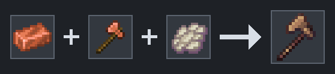

Source: `dev/snaxcraft-content-pack/datapack/data/snax_tools/recipe/hepatizon_axe.json`

### Hepatizon Boots

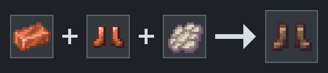

Source: `dev/snaxcraft-content-pack/datapack/data/snax_tools/recipe/hepatizon_boots.json`

### Hepatizon Chestplate

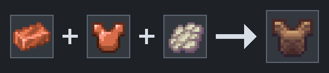

Source: `dev/snaxcraft-content-pack/datapack/data/snax_tools/recipe/hepatizon_chestplate.json`

### Hepatizon Dolabra

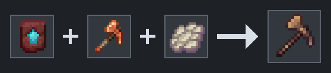

Source: `dev/snaxcraft-content-pack/datapack/data/snax_tools/recipe/hepatizon_dolabra.json`

### Hepatizon Elytra

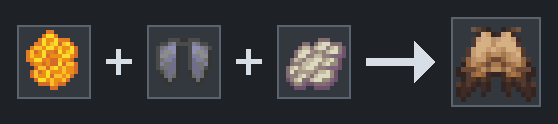

Source: `dev/snaxcraft-content-pack/datapack/data/snax_tools/recipe/hepatizon_elytra.json`

### Hepatizon Helmet

Source: `dev/snaxcraft-content-pack/datapack/data/snax_tools/recipe/hepatizon_helmet.json`

### Hepatizon Hoe

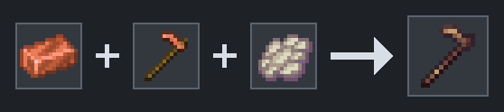

Source: `dev/snaxcraft-content-pack/datapack/data/snax_tools/recipe/hepatizon_hoe.json`

### Hepatizon Leggings

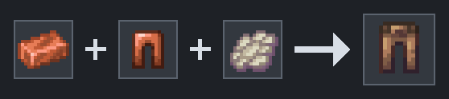

Source: `dev/snaxcraft-content-pack/datapack/data/snax_tools/recipe/hepatizon_leggings.json`

### Hepatizon Mattock

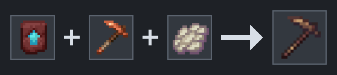

Source: `dev/snaxcraft-content-pack/datapack/data/snax_tools/recipe/hepatizon_mattock.json`

### Hepatizon Pickaxe

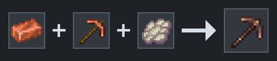

Source: `dev/snaxcraft-content-pack/datapack/data/snax_tools/recipe/hepatizon_pickaxe.json`

### Hepatizon Shovel

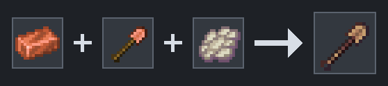

Source: `dev/snaxcraft-content-pack/datapack/data/snax_tools/recipe/hepatizon_shovel.json`

### Hepatizon Spear

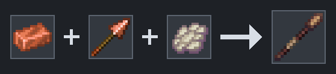

Source: `dev/snaxcraft-content-pack/datapack/data/snax_tools/recipe/hepatizon_spear.json`

### Hepatizon Sword

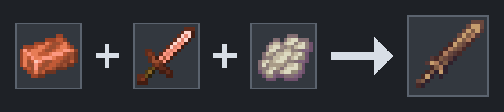

Source: `dev/snaxcraft-content-pack/datapack/data/snax_tools/recipe/hepatizon_sword.json`

## Shakudo

Shakudo upgrades copper-tier gear with Shulker Shell and includes regeneration-focused bonuses.

### Shakudo Axe

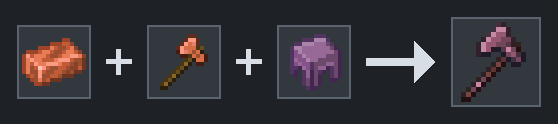

Source: `dev/snaxcraft-content-pack/datapack/data/snax_tools/recipe/shakudo_axe.json`

### Shakudo Boots

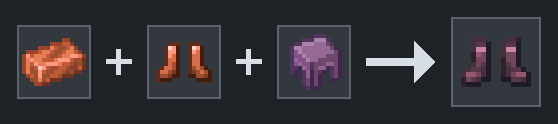

Source: `dev/snaxcraft-content-pack/datapack/data/snax_tools/recipe/shakudo_boots.json`

### Shakudo Chestplate

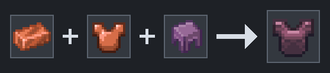

Source: `dev/snaxcraft-content-pack/datapack/data/snax_tools/recipe/shakudo_chestplate.json`

### Shakudo Dolabra

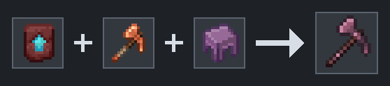

Source: `dev/snaxcraft-content-pack/datapack/data/snax_tools/recipe/shakudo_dolabra.json`

### Shakudo Elytra

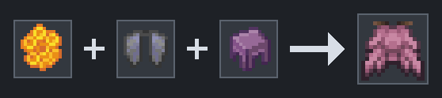

Source: `dev/snaxcraft-content-pack/datapack/data/snax_tools/recipe/shakudo_elytra.json`

### Shakudo Helmet

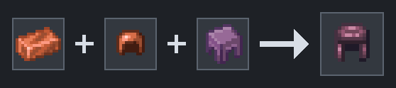

Source: `dev/snaxcraft-content-pack/datapack/data/snax_tools/recipe/shakudo_helmet.json`

### Shakudo Hoe

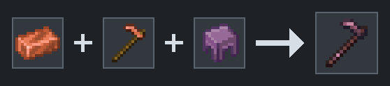

Source: `dev/snaxcraft-content-pack/datapack/data/snax_tools/recipe/shakudo_hoe.json`

### Shakudo Leggings

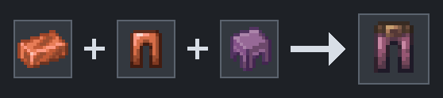

Source: `dev/snaxcraft-content-pack/datapack/data/snax_tools/recipe/shakudo_leggings.json`

### Shakudo Mattock

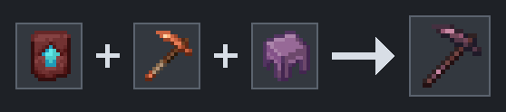

Source: `dev/snaxcraft-content-pack/datapack/data/snax_tools/recipe/shakudo_mattock.json`

### Shakudo Pickaxe

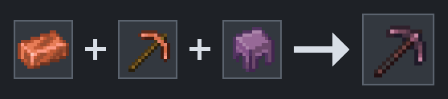

Source: `dev/snaxcraft-content-pack/datapack/data/snax_tools/recipe/shakudo_pickaxe.json`

### Shakudo Shovel

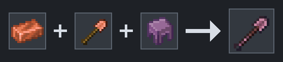

Source: `dev/snaxcraft-content-pack/datapack/data/snax_tools/recipe/shakudo_shovel.json`

### Shakudo Spear

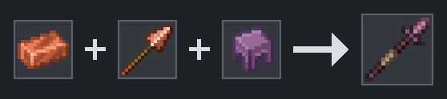

Source: `dev/snaxcraft-content-pack/datapack/data/snax_tools/recipe/shakudo_spear.json`

### Shakudo Sword

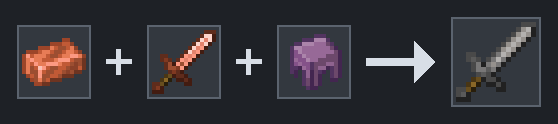

Source: `dev/snaxcraft-content-pack/datapack/data/snax_tools/recipe/shakudo_sword.json`

## Steel

Steel upgrades iron-tier gear with Resin Brick and includes blast-protection and blocking-focused bonuses.

### Steel Axe

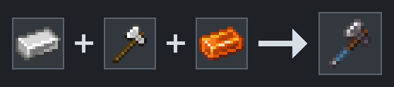

Source: `dev/snaxcraft-content-pack/datapack/data/snax_tools/recipe/steel_axe.json`

### Steel Boots

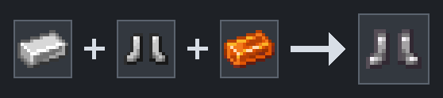

Source: `dev/snaxcraft-content-pack/datapack/data/snax_tools/recipe/steel_boots.json`

### Steel Chestplate

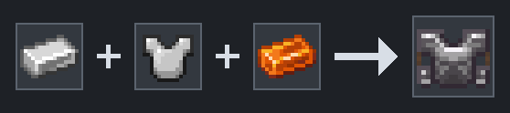

Source: `dev/snaxcraft-content-pack/datapack/data/snax_tools/recipe/steel_chestplate.json`

### Steel Dolabra

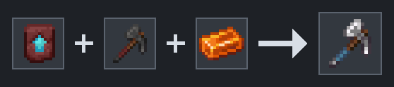

Source: `dev/snaxcraft-content-pack/datapack/data/snax_tools/recipe/steel_dolabra.json`

### Steel Helmet

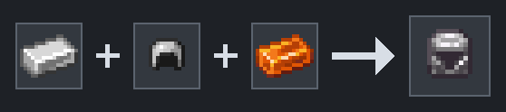

Source: `dev/snaxcraft-content-pack/datapack/data/snax_tools/recipe/steel_helmet.json`

### Steel Hoe

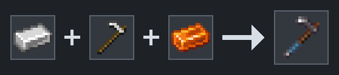

Source: `dev/snaxcraft-content-pack/datapack/data/snax_tools/recipe/steel_hoe.json`

### Steel Leggings

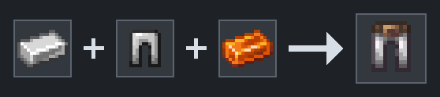

Source: `dev/snaxcraft-content-pack/datapack/data/snax_tools/recipe/steel_leggings.json`

### Steel Mattock

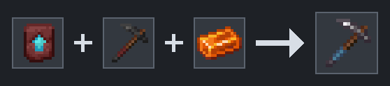

Source: `dev/snaxcraft-content-pack/datapack/data/snax_tools/recipe/steel_mattock.json`

### Steel Pickaxe

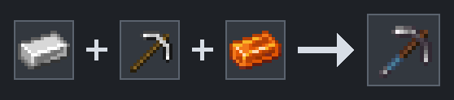

Source: `dev/snaxcraft-content-pack/datapack/data/snax_tools/recipe/steel_pickaxe.json`

### Steel Shears

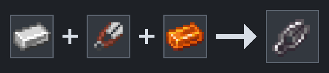

Source: `dev/snaxcraft-content-pack/datapack/data/snax_tools/recipe/steel_shears.json`

### Steel Shovel

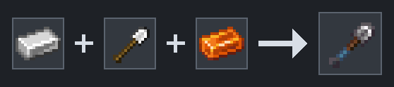

Source: `dev/snaxcraft-content-pack/datapack/data/snax_tools/recipe/steel_shovel.json`

### Steel Spear

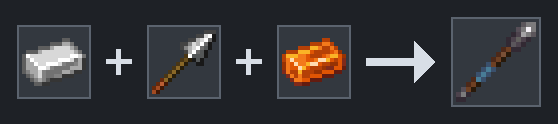

Source: `dev/snaxcraft-content-pack/datapack/data/snax_tools/recipe/steel_spear.json`

### Steel Sword

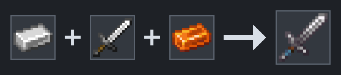

Source: `dev/snaxcraft-content-pack/datapack/data/snax_tools/recipe/steel_sword.json`

## Electrum

Electrum upgrades diamond-tier gear with Heart of the Sea and includes warding-focused bonuses.

### Electrum Axe

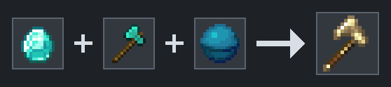

Source: `dev/snaxcraft-content-pack/datapack/data/snax_tools/recipe/electrum_axe.json`

### Electrum Boots

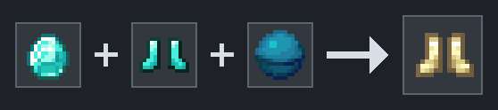

Source: `dev/snaxcraft-content-pack/datapack/data/snax_tools/recipe/electrum_boots.json`

### Electrum Chestplate

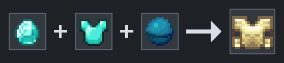

Source: `dev/snaxcraft-content-pack/datapack/data/snax_tools/recipe/electrum_chestplate.json`

### Electrum Dolabra

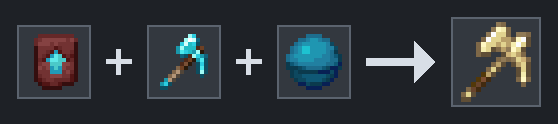

Source: `dev/snaxcraft-content-pack/datapack/data/snax_tools/recipe/electrum_dolabra.json`

### Electrum Helmet

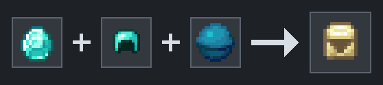

Source: `dev/snaxcraft-content-pack/datapack/data/snax_tools/recipe/electrum_helmet.json`

### Electrum Hoe

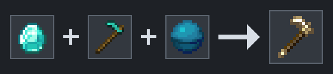

Source: `dev/snaxcraft-content-pack/datapack/data/snax_tools/recipe/electrum_hoe.json`

### Electrum Leggings

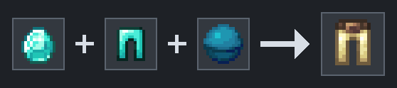

Source: `dev/snaxcraft-content-pack/datapack/data/snax_tools/recipe/electrum_leggings.json`

### Electrum Mattock

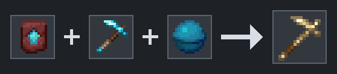

Source: `dev/snaxcraft-content-pack/datapack/data/snax_tools/recipe/electrum_mattock.json`

### Electrum Pickaxe

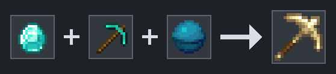

Source: `dev/snaxcraft-content-pack/datapack/data/snax_tools/recipe/electrum_pickaxe.json`

### Electrum Shovel

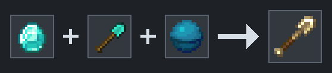

Source: `dev/snaxcraft-content-pack/datapack/data/snax_tools/recipe/electrum_shovel.json`

### Electrum Spear

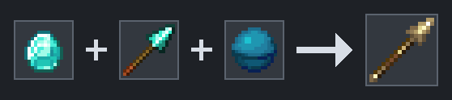

Source: `dev/snaxcraft-content-pack/datapack/data/snax_tools/recipe/electrum_spear.json`

### Electrum Sword

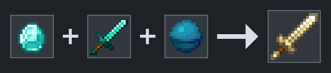

Source: `dev/snaxcraft-content-pack/datapack/data/snax_tools/recipe/electrum_sword.json`

## Adamant

Adamant upgrades diamond-tier gear with Netherite Ingot and includes divinity-focused bonuses.

### Adamant Axe

Source: `dev/snaxcraft-content-pack/datapack/data/snax_tools/recipe/adamant_axe.json`

### Adamant Boots

Source: `dev/snaxcraft-content-pack/datapack/data/snax_tools/recipe/adamant_boots.json`

### Adamant Chestplate

Source: `dev/snaxcraft-content-pack/datapack/data/snax_tools/recipe/adamant_chestplate.json`

### Adamant Claymore

Source: `dev/snaxcraft-content-pack/datapack/data/snax_tools/recipe/adamant_claymore.json`

### Adamant Dolabra

Source: `dev/snaxcraft-content-pack/datapack/data/snax_tools/recipe/adamant_dolabra.json`

### Adamant Helmet

Source: `dev/snaxcraft-content-pack/datapack/data/snax_tools/recipe/adamant_helmet.json`

### Adamant Hoe

Source: `dev/snaxcraft-content-pack/datapack/data/snax_tools/recipe/adamant_hoe.json`

### Adamant Leggings

Source: `dev/snaxcraft-content-pack/datapack/data/snax_tools/recipe/adamant_leggings.json`

### Adamant Mattock

Source: `dev/snaxcraft-content-pack/datapack/data/snax_tools/recipe/adamant_mattock.json`

### Adamant Pickaxe

Source: `dev/snaxcraft-content-pack/datapack/data/snax_tools/recipe/adamant_pickaxe.json`

### Adamant Shovel

Source: `dev/snaxcraft-content-pack/datapack/data/snax_tools/recipe/adamant_shovel.json`

### Adamant Spear

Source: `dev/snaxcraft-content-pack/datapack/data/snax_tools/recipe/adamant_spear.json`

### Adamant Sword

Source: `dev/snaxcraft-content-pack/datapack/data/snax_tools/recipe/adamant_sword.json`

## Credit and license

NOT AN OFFICIAL MINECRAFT PRODUCT. NOT APPROVED BY OR ASSOCIATED WITH MOJANG OR MICROSOFT.

Alloy recipes, behavior, and assets adapted from Matcha Flavoured by **klei_wright**, licensed **CC-BY-NC-SA 4.0**.

Source: https://modrinth.com/datapack/matcha-flavoured

## See also

- [Quest Point shop](snaxcraft-qp-shop.md)
- [Hybrid tools](snaxcraft-hybrids.md)
- [Crafting shortcuts](snaxcraft-shortcuts.md)
