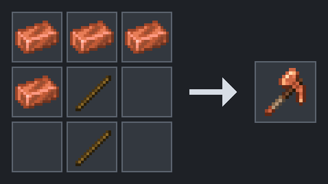
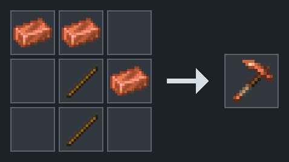
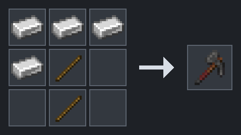
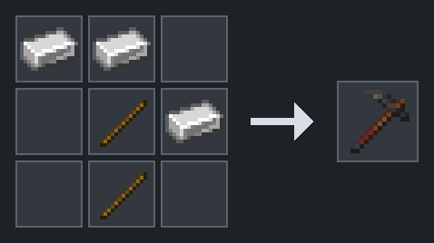
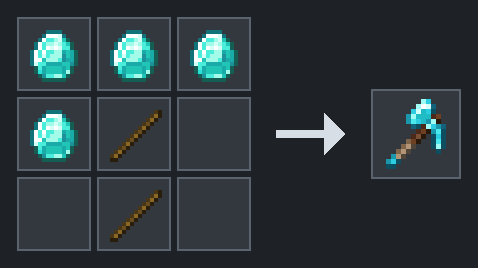
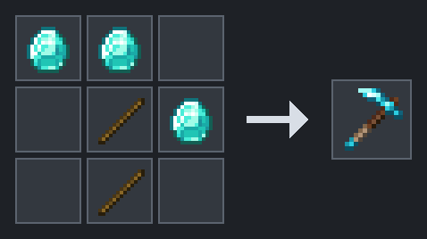

# snaxcraft hybrid tools

**Edition:** Java 
**Version:** 26.2 Paper 
**Last verified:** 2026-08-17

**Applies to:** snaxcraft server content

## What they do

- **Dolabra:** one tool for pickaxe and axe blocks.
- **Mattock:** one tool for shovel and hoe blocks.

Hybrids combine two tool types in one slot, so you carry fewer tools. The trade is speed: a copper dolabra mines at 5 where a copper pickaxe mines at 6. Single-purpose tools are still there when you want the faster dig.

## Crafting

These are normal **crafting table** recipes, not smithing. Copper, iron, and diamond versions use sticks plus the matching ingots or gems.

Each recipe lists **Ingredients** in player item names. The image shows the 3x3 crafting grid on the left and what you get on the right. Empty squares in the image must stay empty in your grid. The pattern can be mirrored left to right.

Source: https://minecraft.wiki/w/Crafting_Table

### Copper Dolabra

**Ingredients:** 4 Copper Ingot and 2 Stick

**Stats:** Mining Speed 5, Damage 5, Attack Speed 0.8.

### Copper Mattock

**Ingredients:** 3 Copper Ingot and 2 Stick

**Stats:** Mining Speed 5, Damage 1, Attack Speed 2.

### Iron Dolabra

**Ingredients:** 4 Iron Ingot and 2 Stick

**Stats:** Mining Speed 6, Damage 6, Attack Speed 0.9.

### Iron Mattock

**Ingredients:** 3 Iron Ingot and 2 Stick

**Stats:** Mining Speed 6, Damage 4, Attack Speed 3.

### Diamond Dolabra

**Ingredients:** 4 Diamond and 2 Stick

**Stats:** Mining Speed 8, Damage 7, Attack Speed 1.

### Diamond Mattock

**Ingredients:** 3 Diamond and 2 Stick

**Stats:** Mining Speed 8, Damage 4, Attack Speed 3.

## Credit and license

NOT AN OFFICIAL MINECRAFT PRODUCT. NOT APPROVED BY OR ASSOCIATED WITH MOJANG OR MICROSOFT.

Hybrid recipes, behavior, and assets adapted from Matcha Flavoured by **klei_wright**, licensed **CC-BY-NC-SA 4.0**.

Source: https://modrinth.com/datapack/matcha-flavoured

## See also

- [Quest Point shop](snaxcraft-qp-shop.md)
- [Alloy equipment](snaxcraft-alloys.md)
- [Crafting shortcuts](snaxcraft-shortcuts.md)
