# snaxcraft kitchen recipes

**Edition:** Java  
**Version:** 26.2 Paper  
**Last verified:** 2026-08-15
**Applies to:** snaxcraft server content

## How to use this cookbook

- **Shapeless** recipes can go anywhere in the crafting grid.
- Recipe images show the crafting grid or cooking input. Shapeless recipes fill the top row left to right; a space is an empty slot.
- Cooking entries list every supported station. A furnace recipe does not automatically work in a smoker.
- Food values are shown as **nutrition / saturation**. Two nutrition points fill one hunger icon.
- Most foods also apply a short, hidden regeneration pulse. The Effects line lists the additional visible or lasting effects instead of repeating that pulse on every entry.
- Flour, Dough, and other named ingredients below are their custom items. Ordinary paper or another look-alike is not a substitute.

Source: https://minecraft.wiki/w/Data_component_format/food

Building, storage, and material-conversion recipes are in [Crafting and material shortcuts](snaxcraft-shortcuts.md).

## Recipe index

- [Apple Empanada](#apple-empanada)
- [Bag of Flour](#bag-of-flour)
- [Baked Apple](#baked-apple)
- [Baked Golden Apple](#baked-golden-apple)
- [Baked Potato](#baked-potato)
- [Baked Pumpkin](#baked-pumpkin)
- [Bokguk](#bokguk)
- [Braised Brown Mushroom](#braised-brown-mushroom)
- [Braised Crimson Fungus](#braised-crimson-fungus)
- [Braised Toadstool](#braised-toadstool)
- [Braised Warped Fungus](#braised-warped-fungus)
- [Bread](#bread)
- [Brownie](#brownie)
- [Bruschetta](#bruschetta)
- [Cake](#cake)
- [Canned Apples](#canned-apples)
- [Canned Golden Apples](#canned-golden-apples)
- [Carrot Cupcake](#carrot-cupcake)
- [Charred Fish](#charred-fish)
- [Charred Meat](#charred-meat)
- [Charred Potato](#charred-potato)
- [Cheese](#cheese)
- [Cheese Pizza](#cheese-pizza)
- [Chocolate](#chocolate)
- [Chocolate Chip Cookie](#chocolate-chip-cookie)
- [Chorus Mochi](#chorus-mochi)
- [Cooked Beef](#cooked-beef)
- [Cooked Chicken](#cooked-chicken)
- [Cooked Cod](#cooked-cod)
- [Cooked Mutton](#cooked-mutton)
- [Cooked Porkchop](#cooked-porkchop)
- [Cooked Pufferfish](#cooked-pufferfish)
- [Cooked Rabbit](#cooked-rabbit)
- [Cooked Salmon](#cooked-salmon)
- [Cooked Tropical Fish](#cooked-tropical-fish)
- [Crimson Stroganoff](#crimson-stroganoff)
- [Curry Stock](#curry-stock)
- [Dough](#dough)
- [Dried Kelp](#dried-kelp)
- [Flour](#flour)
- [French Toast](#french-toast)
- [Fried Egg](#fried-egg)
- [Gilded Empananda](#gilded-empananda)
- [Gimmari](#gimmari)
- [Glow Berry Crumble](#glow-berry-crumble)
- [Glow Berry Jam](#glow-berry-jam)
- [Glow Mash](#glow-mash)
- [Gnocchi](#gnocchi)
- [Golden Apple](#golden-apple)
- [Golden Carrot](#golden-carrot)
- [Golden Carrot Cupcake](#golden-carrot-cupcake)
- [Golden Pickled Carrots](#golden-pickled-carrots)
- [Green Curry](#green-curry)
- [Green Curry Stock](#green-curry-stock)
- [Grilled Melon](#grilled-melon)
- [Grilled Tomatoes](#grilled-tomatoes)
- [Honey Ginger Tea](#honey-ginger-tea)
- [Honied French Toast](#honied-french-toast)
- [Japanese Curry](#japanese-curry)
- [Kontomire-Dandelion Stew](#kontomire-dandelion-stew)
- [Latke](#latke)
- [Mead](#mead)
- [Meat Pizza](#meat-pizza)
- [Melon Sorbet](#melon-sorbet)
- [Milk Bottle](#milk-bottle)
- [Mushroom Pizza](#mushroom-pizza)
- [Naan](#naan)
- [Pad Thai](#pad-thai)
- [Paneer Curry Stock](#paneer-curry-stock)
- [Paneer Makhani](#paneer-makhani)
- [Pickled Carrots](#pickled-carrots)
- [Pickled Crimson Fungus](#pickled-crimson-fungus)
- [Pickled Mushrooms](#pickled-mushrooms)
- [Pickled Potatoes](#pickled-potatoes)
- [Pickled Red Mushrooms](#pickled-red-mushrooms)
- [Pickled Warped Fungus](#pickled-warped-fungus)
- [Popped Chorus Fruit](#popped-chorus-fruit)
- [Puerquito](#puerquito)
- [Pumpkin Empanada](#pumpkin-empanada)
- [Pumpkin Jam](#pumpkin-jam)
- [Pupusa](#pupusa)
- [Ramen Stock](#ramen-stock)
- [Rind Jam](#rind-jam)
- [Steamed Carrots](#steamed-carrots)
- [Steamed Golden Carrots](#steamed-golden-carrots)
- [Stroganoff](#stroganoff)
- [Sugar from Honey Bottle](#sugar-from-honey-bottle)
- [Sundried Tomatotes](#sundried-tomatotes)
- [Sweet Berry Danish](#sweet-berry-danish)
- [Sweet Berry Jam](#sweet-berry-jam)
- [Sweet Berry Mash](#sweet-berry-mash)
- [Sweet Berry Toast](#sweet-berry-toast)
- [Toadstool Stroganoff](#toadstool-stroganoff)
- [Tonkotsu Ramen](#tonkotsu-ramen)
- [Warped Pizza](#warped-pizza)
- [Warped Stroganoff](#warped-stroganoff)

## Staples and ingredients

### Flour

**Makes:** 1 Flour  
**Method:** Shapeless crafting  

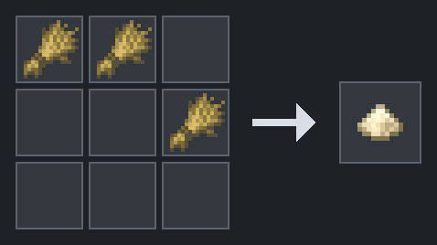

Source: `dev/snaxcraft-content-pack/datapack/data/snax/recipe/flour.json`

### Bag of Flour

**Makes:** 1 Bag of Flour  
**Method:** Shaped crafting

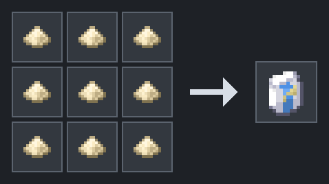

Source: `dev/snaxcraft-content-pack/datapack/data/snax/recipe/flour_bag.json`

### Dough

**Egg recipe:**

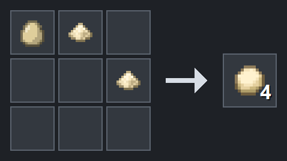

**Water recipe:**

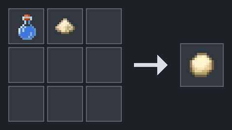

Both kinds bake into Bread. Recipes that need several Dough are usually cheaper with the egg recipe.

Source: `dev/snaxcraft-content-pack/datapack/data/snax/recipe/dough.json`
Source: `dev/snaxcraft-content-pack/datapack/data/snax/recipe/dough_from_water.json`

### Bread

**Makes:** 1 Bread from 1 Dough  
**Stations:** Furnace - 5 seconds; campfire - 10 seconds  
**Food:** 5 nutrition (2.5 hunger icons) / 6 saturation  
**Effects:** Cleanses poison, mining fatigue, wither, weakness, bad omen, blindness, darkness, infested, weaving, nausea, oozing, and slowness.

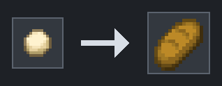

Source: `dev/snaxcraft-content-pack/datapack/data/snax/recipe/bread.json`
Source: `dev/snaxcraft-content-pack/datapack/data/snax/recipe/bread_campfire.json`

### Cheese

**Makes:** 4 Cheese  
**Method:** Shapeless crafting  
**Food:** 2 nutrition (1 hunger icon) / 1.2 saturation

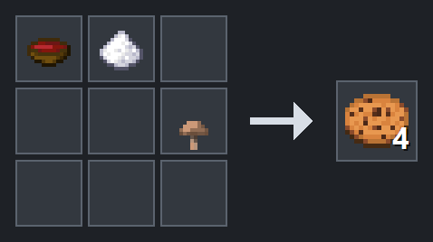

Source: `dev/snaxcraft-content-pack/datapack/data/snax/recipe/cheese.json`

### Chocolate

**Makes:** 1 Chocolate from 1 Cocoa Beans  
**Stations:** Furnace - 5 seconds; campfire - 10 seconds  
**Food:** 1 nutrition (0.5 hunger icon) / 0.6 saturation  
**Effects:** Haste I for 30 seconds.

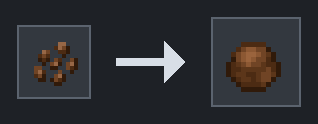

Source: `dev/snaxcraft-content-pack/datapack/data/snax/recipe/chocolate.json`
Source: `dev/snaxcraft-content-pack/datapack/data/snax/recipe/chocolate_campfire.json`

### Milk Bottle

**Makes:** 4 Milk Bottles  
**Method:** Shapeless crafting  
**Food:** 2 nutrition (1 hunger icon) / 1.2 saturation  
**Effects:** Clears all status effects when drunk.

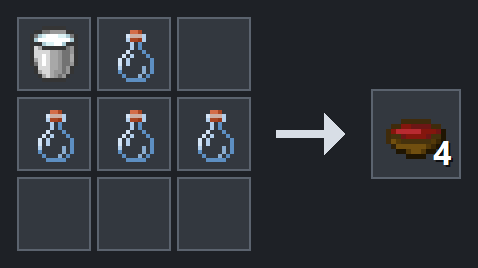

Source: `dev/snaxcraft-content-pack/datapack/data/snax/recipe/milk_bottle.json`

### Sugar from Honey Bottle

**Makes:** 2 Sugar  
**Method:** Shapeless crafting  

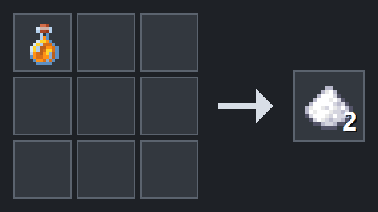

Source: `dev/snaxcraft-content-pack/datapack/data/snax/recipe/sugar_from_honey_bottle.json`

## Cooked basics

### Baked Apple

**Makes:** 1 Baked Apple from 1 Apple  
**Stations:** Furnace - 5 seconds; campfire - 10 seconds  
**Food:** 2 nutrition (1 hunger icon) / 1.2 saturation  
**Effects:** Regeneration I for 10 seconds.

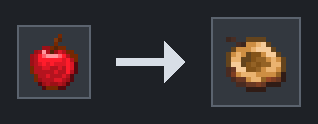

Source: `dev/snaxcraft-content-pack/datapack/data/snax/recipe/baked_apple.json`
Source: `dev/snaxcraft-content-pack/datapack/data/snax/recipe/baked_apple_campfire.json`

### Baked Golden Apple

**Makes:** 1 Baked Golden Apple from 1 Golden Apple  
**Stations:** Furnace - 5 seconds; campfire - 10 seconds  
**Food:** 4 nutrition (2 hunger icons) / 2.4 saturation  
**Effects:** Absorption I for 2 minutes and Regeneration I for 1 minute.

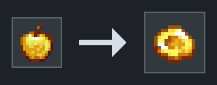

Source: `dev/snaxcraft-content-pack/datapack/data/snax/recipe/baked_golden_apple.json`
Source: `dev/snaxcraft-content-pack/datapack/data/snax/recipe/baked_golden_apple_campfire.json`

### Baked Potato

**Makes:** 1 Baked Potato from 1 Potato  
**Stations:** Furnace - 5 seconds; campfire - 10 seconds  
**Food:** 3 nutrition (1.5 hunger icons) / 1.8 saturation  
**Effects:** No additional lasting effect.

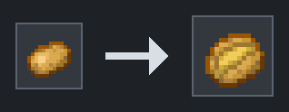

Source: `dev/snaxcraft-content-pack/datapack/data/snax/recipe/baked_potato.json`
Source: `dev/snaxcraft-content-pack/datapack/data/snax/recipe/baked_potato_campfire.json`

### Baked Pumpkin

**Makes:** 1 Baked Pumpkin from 1 Pumpkin  
**Stations:** Furnace - 5 seconds; campfire - 10 seconds  
**Food:** 1 nutrition (0.5 hunger icon) / 0.6 saturation  
**Effects:** Resistance I for 10 seconds.

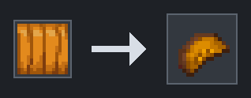

Source: `dev/snaxcraft-content-pack/datapack/data/snax/recipe/baked_pumpkin.json`
Source: `dev/snaxcraft-content-pack/datapack/data/snax/recipe/baked_pumpkin_campfire.json`

### Braised Brown Mushroom

**Makes:** 1 Braised Brown Mushroom from 1 Brown Mushroom  
**Stations:** Furnace - 5 seconds; campfire - 10 seconds  
**Food:** 1 nutrition (0.5 hunger icon) / 0.6 saturation  
**Effects:** No additional lasting effect.

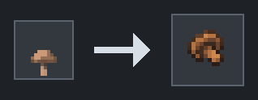

Source: `dev/snaxcraft-content-pack/datapack/data/snax/recipe/braised_brown_mushroom.json`
Source: `dev/snaxcraft-content-pack/datapack/data/snax/recipe/braised_brown_mushroom_campfire.json`

### Braised Crimson Fungus

**Makes:** 1 Braised Crimson Fungus from 1 Crimson Fungus  
**Stations:** Furnace - 5 seconds; campfire - 10 seconds  
**Food:** 1 nutrition (0.5 hunger icon) / 0.6 saturation  
**Effects:** Weakness I for 30 seconds.

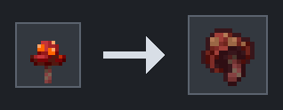

Source: `dev/snaxcraft-content-pack/datapack/data/snax/recipe/braised_crimson_fungus.json`
Source: `dev/snaxcraft-content-pack/datapack/data/snax/recipe/braised_crimson_fungus_campfire.json`

### Braised Toadstool

**Makes:** 1 Braised Toadstool from 1 Red Mushroom  
**Stations:** Furnace - 5 seconds; campfire - 10 seconds  
**Food:** 1 nutrition (0.5 hunger icon) / 0.6 saturation  
**Effects:** Poison I for 30 seconds.

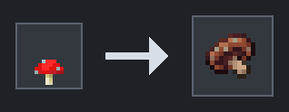

Source: `dev/snaxcraft-content-pack/datapack/data/snax/recipe/braised_red_mushroom.json`
Source: `dev/snaxcraft-content-pack/datapack/data/snax/recipe/braised_red_mushroom_campfire.json`

### Braised Warped Fungus

**Makes:** 1 Braised Warped Fungus from 1 Warped Fungus  
**Stations:** Furnace - 5 seconds; campfire - 10 seconds  
**Food:** 1 nutrition (0.5 hunger icon) / 0.6 saturation  
**Effects:** Invisibility I for 30 seconds.

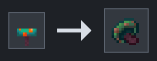

Source: `dev/snaxcraft-content-pack/datapack/data/snax/recipe/brasied_warped_fungus.json`
Source: `dev/snaxcraft-content-pack/datapack/data/snax/recipe/brasied_warped_fungus_campfire.json`

### Charred Fish

**Makes:** 1 Charred Fish  
**Method:** Smoker - 5 seconds  
**Ingredient:** 1 raw Tropical Fish, Pufferfish, Cod, or Salmon  
**Food:** 1 nutrition (0.5 hunger icon) / 0.6 saturation  
**Effects:** No additional lasting effect.

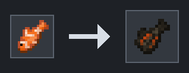

Source: `dev/snaxcraft-content-pack/datapack/data/snax/recipe/charred_fish.json`

### Charred Meat

**Makes:** 1 Charred Meat  
**Method:** Smoker - 5 seconds  
**Ingredient:** 1 raw Rabbit, Chicken, Beef, Porkchop, or Mutton  
**Food:** 1 nutrition (0.5 hunger icon) / 0.6 saturation  
**Effects:** No additional lasting effect.

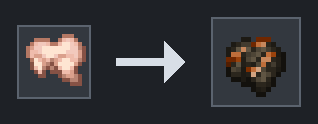

Source: `dev/snaxcraft-content-pack/datapack/data/snax/recipe/charred_meat.json`

### Charred Potato

**Makes:** 1 Charred Potato from 1 Potato  
**Method:** Smoker - 5 seconds  
**Food:** 1 nutrition (0.5 hunger icon) / 0.6 saturation  
**Effects:** No additional lasting effect.

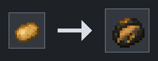

Source: `dev/snaxcraft-content-pack/datapack/data/snax/recipe/charred_potato.json`

### Cooked Beef

**Makes:** 1 Cooked Beef from 1 Raw Beef  
**Stations:** Furnace - 5 seconds; campfire - 10 seconds  
**Food:** 8 nutrition (4 hunger icons) / 12.8 saturation  
**Effects:** No additional lasting effect.

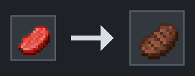

Source: `dev/snaxcraft-content-pack/datapack/data/snax/recipe/cooked_beef.json`
Source: `dev/snaxcraft-content-pack/datapack/data/snax/recipe/cooked_beef_campfire.json`

### Cooked Chicken

**Makes:** 1 Cooked Chicken from 1 Raw Chicken  
**Stations:** Furnace - 5 seconds; campfire - 10 seconds  
**Food:** 2 nutrition (1 hunger icon) / 1.2 saturation  
**Effects:** No additional lasting effect.

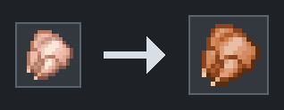

Source: `dev/snaxcraft-content-pack/datapack/data/snax/recipe/cooked_chicken.json`
Source: `dev/snaxcraft-content-pack/datapack/data/snax/recipe/cooked_chicken_campfire.json`

### Cooked Cod

**Makes:** 1 Cooked Cod from 1 Raw Cod  
**Stations:** Furnace - 5 seconds; campfire - 10 seconds  
**Food:** 2 nutrition (1 hunger icon) / 1.2 saturation  
**Effects:** No additional lasting effect.

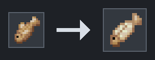

Source: `dev/snaxcraft-content-pack/datapack/data/snax/recipe/cooked_cod.json`
Source: `dev/snaxcraft-content-pack/datapack/data/snax/recipe/cooked_cod_campfire.json`

### Cooked Mutton

**Makes:** 1 Cooked Mutton from 1 Raw Mutton  
**Stations:** Furnace - 5 seconds; campfire - 10 seconds  
**Food:** 2 nutrition (1 hunger icon) / 1.2 saturation  
**Effects:** No additional lasting effect.

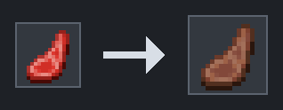

Source: `dev/snaxcraft-content-pack/datapack/data/snax/recipe/cooked_mutton.json`
Source: `dev/snaxcraft-content-pack/datapack/data/snax/recipe/cooked_mutton_campfire.json`

### Cooked Porkchop

**Makes:** 1 Cooked Porkchop from 1 Raw Porkchop  
**Stations:** Furnace - 5 seconds; campfire - 10 seconds  
**Food:** 2 nutrition (1 hunger icon) / 1.2 saturation  
**Effects:** No additional lasting effect.

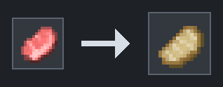

Source: `dev/snaxcraft-content-pack/datapack/data/snax/recipe/cooked_pork.json`
Source: `dev/snaxcraft-content-pack/datapack/data/snax/recipe/cooked_pork_campfire.json`

### Cooked Pufferfish

**Makes:** 1 Cooked Pufferfish from 1 Pufferfish  
**Stations:** Furnace - 5 seconds; campfire - 10 seconds  
**Food:** 2 nutrition (1 hunger icon) / 1.2 saturation  
**Effects:** Conduit Power I for 30 seconds.

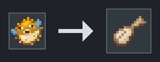

Source: `dev/snaxcraft-content-pack/datapack/data/snax/recipe/cooked_pufferfish.json`
Source: `dev/snaxcraft-content-pack/datapack/data/snax/recipe/cooked_pufferfish_campfire.json`

### Cooked Rabbit

**Makes:** 1 Cooked Rabbit from 1 Raw Rabbit  
**Stations:** Furnace - 5 seconds; campfire - 10 seconds  
**Food:** 2 nutrition (1 hunger icon) / 1.2 saturation  
**Effects:** No additional lasting effect.

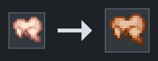

Source: `dev/snaxcraft-content-pack/datapack/data/snax/recipe/cooked_rabbit.json`
Source: `dev/snaxcraft-content-pack/datapack/data/snax/recipe/cooked_rabbit_campfire.json`

### Cooked Salmon

**Makes:** 1 Cooked Salmon from 1 Raw Salmon  
**Stations:** Furnace - 5 seconds; campfire - 10 seconds  
**Food:** 3 nutrition (1.5 hunger icons) / 1.8 saturation  
**Effects:** No additional lasting effect.

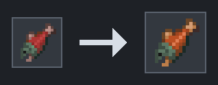

Source: `dev/snaxcraft-content-pack/datapack/data/snax/recipe/cooked_salmon.json`
Source: `dev/snaxcraft-content-pack/datapack/data/snax/recipe/cooked_salmon_campfire.json`

### Cooked Tropical Fish

Cooking 1 Tropical Fish makes 1 Cooked Cod.

**Stations:** Furnace - 5 seconds; campfire - 10 seconds  
**Food:** 2 nutrition (1 hunger icon) / 1.2 saturation  
**Effects:** No additional lasting effect.

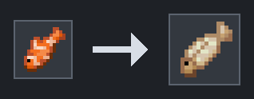

Source: `dev/snaxcraft-content-pack/datapack/data/snax/recipe/cooked_tropical_fish.json`
Source: `dev/snaxcraft-content-pack/datapack/data/snax/recipe/cooked_tropical_fish_campfire.json`

### Dried Kelp

**Cooking:** 1 Kelp -> 1 Dried Kelp; furnace or campfire - 5 seconds  
**Unpacking:** 1 Dried Kelp Block -> 9 Dried Kelp (shapeless)  
**Food:** 1 nutrition (0.5 hunger icon) / 0.6 saturation  
**Effects:** Water Breathing I for 10 seconds.

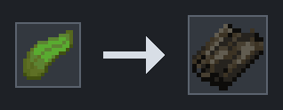

Source: `dev/snaxcraft-content-pack/datapack/data/snax/recipe/dried_kelp.json`
Source: `dev/snaxcraft-content-pack/datapack/data/snax/recipe/dried_kelp_campfire.json`
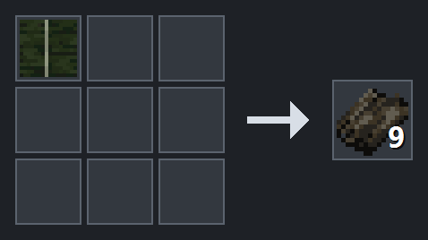

Source: `dev/snaxcraft-content-pack/datapack/data/snax/recipe/dried_kelp_from_dried_kelp_block.json`

### Fried Egg

**Makes:** 1 Fried Egg from 1 Egg of any color  
**Stations:** Furnace - 5 seconds; campfire - 10 seconds  
**Food:** 1 nutrition (0.5 hunger icon) / 0.6 saturation  
**Effects:** No additional lasting effect.

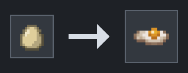

Source: `dev/snaxcraft-content-pack/datapack/data/snax/recipe/fried_egg.json`
Source: `dev/snaxcraft-content-pack/datapack/data/snax/recipe/fried_egg_campfire.json`

### Glow Mash

**Makes:** 1 Glow Mash from 1 Glow Berries  
**Stations:** Furnace - 5 seconds; campfire - 10 seconds  
**Food:** 1 nutrition (0.5 hunger icon) / 0.6 saturation  
**Effects:** No additional lasting effect.

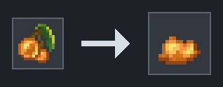

Source: `dev/snaxcraft-content-pack/datapack/data/snax/recipe/glow_mash.json`
Source: `dev/snaxcraft-content-pack/datapack/data/snax/recipe/glow_mash_campfire.json`

### Golden Apple

**Makes:** 1 Golden Apple  
**Method:** Shaped crafting

**Food:** 2 nutrition (1 hunger icon) / 1.2 saturation  
**Effects:** Regeneration I for 30 seconds and Absorption I for 2 minutes.

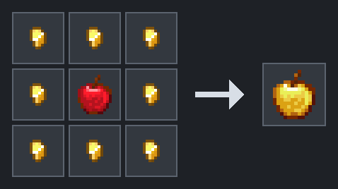

Source: `dev/snaxcraft-content-pack/datapack/data/snax/recipe/golden_apple.json`

### Golden Carrot

**Makes:** 1 Golden Carrot  
**Method:** Shaped crafting

**Food:** 1 nutrition (0.5 hunger icon) / 0.6 saturation  
**Effects:** Night Vision I for 30 seconds.

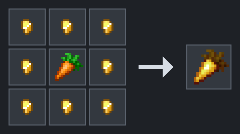

Source: `dev/snaxcraft-content-pack/datapack/data/snax/recipe/golden_carrot.json`

### Grilled Melon

**Makes:** 1 Grilled Melon from 1 Melon Slice  
**Stations:** Furnace - 5 seconds; campfire - 10 seconds  
**Food:** 1 nutrition (0.5 hunger icon) / 0.6 saturation  
**Effects:** Fire Resistance I for 10 seconds.

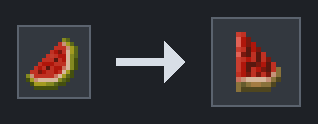

Source: `dev/snaxcraft-content-pack/datapack/data/snax/recipe/grilled_melon.json`
Source: `dev/snaxcraft-content-pack/datapack/data/snax/recipe/grilled_melon_campfire.json`

### Grilled Tomatoes

**Makes:** 1 Grilled Tomatoes from 1 Beetroot  
**Stations:** Furnace - 5 seconds; campfire - 10 seconds  
**Food:** 2 nutrition (1 hunger icon) / 1.2 saturation  
**Effects:** Strength I for 10 seconds.

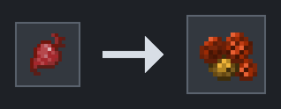

Source: `dev/snaxcraft-content-pack/datapack/data/snax/recipe/grilled_tomatoes.json`
Source: `dev/snaxcraft-content-pack/datapack/data/snax/recipe/grilled_tomatoes_campfire.json`

### Popped Chorus Fruit

**Makes:** 1 Popped Chorus Fruit from 1 Chorus Fruit  
**Stations:** Furnace or campfire - 5 seconds  
**Food:** 1 nutrition (0.5 hunger icon) / 0.6 saturation  
**Effects:** Levitation III for 3 seconds.

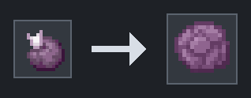

Source: `dev/snaxcraft-content-pack/datapack/data/snax/recipe/popped_chorus_fruit.json`
Source: `dev/snaxcraft-content-pack/datapack/data/snax/recipe/popped_chorus_fruit_campfire.json`

### Steamed Golden Carrots

**Makes:** 1 Steamed Golden Carrots from 1 Golden Carrot  
**Stations:** Furnace - 5 seconds; campfire - 10 seconds  
**Food:** 1 nutrition (0.5 hunger icon) / 0.6 saturation  
**Effects:** Night Vision I for 1 minute.

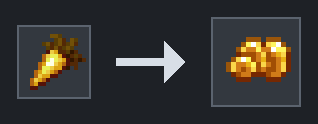

Source: `dev/snaxcraft-content-pack/datapack/data/snax/recipe/golden_steamed_carrots.json`
Source: `dev/snaxcraft-content-pack/datapack/data/snax/recipe/golden_steamed_carrots_campfire.json`

### Steamed Carrots

**Makes:** 1 Steamed Carrots from 1 Carrot  
**Stations:** Furnace - 5 seconds; campfire - 10 seconds  
**Food:** 1 nutrition (0.5 hunger icon) / 0.6 saturation  
**Effects:** Night Vision I for 10 seconds.

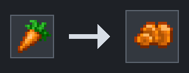

Source: `dev/snaxcraft-content-pack/datapack/data/snax/recipe/steamed_carrots.json`
Source: `dev/snaxcraft-content-pack/datapack/data/snax/recipe/steamed_carrots_campfire.json`

### Sweet Berry Mash

**Makes:** 1 Sweet Berry Mash from 1 Sweet Berries  
**Stations:** Furnace - 5 seconds; campfire - 10 seconds  
**Food:** 1 nutrition (0.5 hunger icon) / 0.6 saturation  
**Effects:** Health Boost I for 10 seconds.

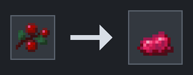

Source: `dev/snaxcraft-content-pack/datapack/data/snax/recipe/sweet_berry_mash.json`
Source: `dev/snaxcraft-content-pack/datapack/data/snax/recipe/sweet_berry_mash_campfire.json`

## Fruit, vegetables, and preserves

### Canned Apples

**Makes:** 1 Canned Apples  
**Method:** Shapeless crafting  
**Food:** 3 nutrition (1.5 hunger icons) / 1.8 saturation  
**Effects:** Regeneration I for 1 minute. Returns the bottle after use.

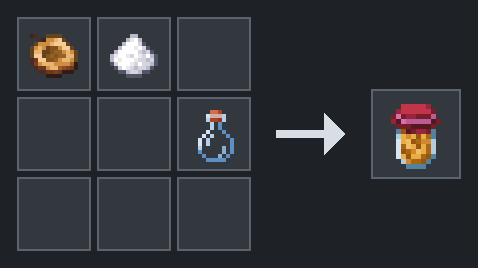

Source: `dev/snaxcraft-content-pack/datapack/data/snax/recipe/canned_apples.json`

### Canned Golden Apples

**Makes:** 1 Canned Golden Apples  
**Method:** Shapeless crafting  
**Food:** 4 nutrition (2 hunger icons) / 2.4 saturation  
**Effects:** Regeneration II for 20 seconds and Absorption II for 2 minutes. Returns the bottle after use.

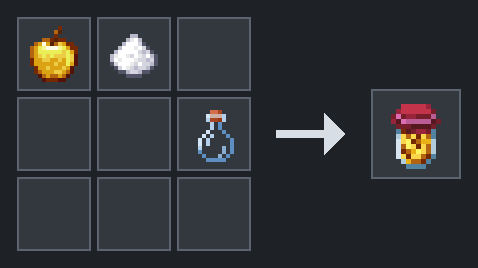

Source: `dev/snaxcraft-content-pack/datapack/data/snax/recipe/canned_golden_apples.json`

### Glow Berry Jam

**Makes:** 1 Glow Berry Jam  
**Method:** Shapeless crafting  
**Food:** 2 nutrition (1 hunger icon) / 1.2 saturation  
**Effects:** No additional lasting effect. Returns the bottle after use.

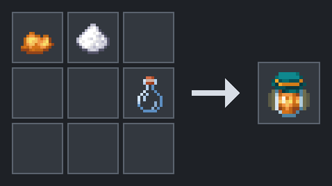

Source: `dev/snaxcraft-content-pack/datapack/data/snax/recipe/glow_jam.json`

### Golden Pickled Carrots

**Makes:** 1 Golden Pickled Carrots  
**Method:** Shapeless crafting  
**Food:** 2 nutrition (1 hunger icon) / 1.2 saturation  
**Effects:** Night Vision I for 10 minutes. Returns the bottle after use.

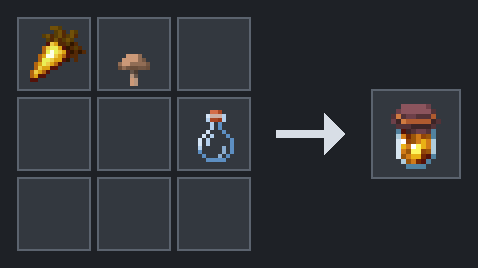

Source: `dev/snaxcraft-content-pack/datapack/data/snax/recipe/golden_pickled_carrots.json`

### Melon Sorbet

**Makes:** 1 Melon Sorbet  
**Method:** Shapeless crafting  
**Food:** 2 nutrition (1 hunger icon) / 1.2 saturation  
**Effects:** Fire Resistance I for 10 minutes. Returns the bottle after use.

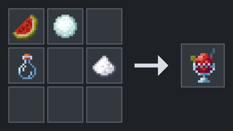

Source: `dev/snaxcraft-content-pack/datapack/data/snax/recipe/melon_sorbet.json`

### Pickled Carrots

**Makes:** 1 Pickled Carrots  
**Method:** Shapeless crafting  
**Food:** 2 nutrition (1 hunger icon) / 1.2 saturation  
**Effects:** Night Vision I for 5 minutes. Returns the bottle after use.

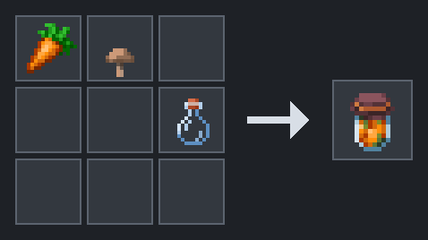

Source: `dev/snaxcraft-content-pack/datapack/data/snax/recipe/pickled_carrots.json`

### Pickled Crimson Fungus

**Makes:** 1 throwable Pickled Crimson Fungus  
**Method:** Shapeless crafting  
**Effect:** Applies Weakness II for 1 minute when the splash hits.

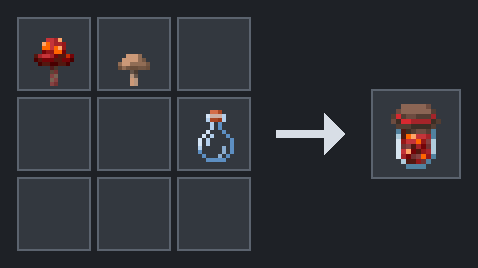

Source: `dev/snaxcraft-content-pack/datapack/data/snax/recipe/pickled_crimson_fungus.json`

### Pickled Mushrooms

**Makes:** 1 Pickled Mushrooms  
**Method:** Shapeless crafting  
**Food:** 3 nutrition (1.5 hunger icons) / 1.8 saturation  
**Effects:** No additional lasting effect. Returns the bottle after use.

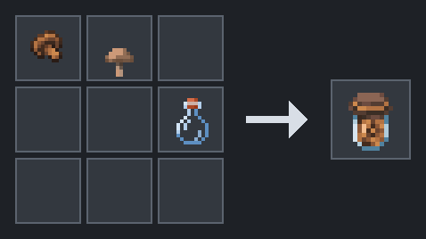

Source: `dev/snaxcraft-content-pack/datapack/data/snax/recipe/pickled_mushrooms.json`

### Pickled Potatoes

**Makes:** 1 Pickled Potatoes  
**Method:** Shapeless crafting  
**Food:** 5 nutrition (2.5 hunger icons) / 3 saturation  
**Effects:** No additional lasting effect. Returns the bottle after use.

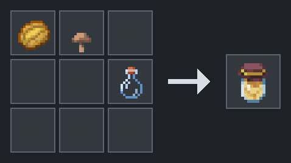

Source: `dev/snaxcraft-content-pack/datapack/data/snax/recipe/pickled_potatoes.json`

### Pickled Red Mushrooms

**Makes:** 1 throwable Pickled Red Mushrooms  
**Method:** Shapeless crafting  
**Effect:** Applies Poison II for 1 minute when the splash hits.

Source: `dev/snaxcraft-content-pack/datapack/data/snax/recipe/pickled_red_mushrooms.json`

### Sundried Tomatotes

The in-game item uses the spelling **Tomatotes**.

**Makes:** 1 Sundried Tomatotes  
**Method:** Shapeless crafting  
**Food:** 3 nutrition (1.5 hunger icons) / 1.8 saturation  
**Effects:** Strength I for 5 minutes. Returns the bottle after use.

Source: `dev/snaxcraft-content-pack/datapack/data/snax/recipe/pickled_tomatoes.json`

### Pickled Warped Fungus

**Makes:** 1 Pickled Warped Fungus  
**Method:** Shapeless crafting  
**Food:** 2 nutrition (1 hunger icon) / 1.2 saturation  
**Effects:** Invisibility I for 5 minutes. Returns the bottle after use.

Source: `dev/snaxcraft-content-pack/datapack/data/snax/recipe/pickled_warped_fungus.json`

### Pumpkin Jam

**Makes:** 1 Pumpkin Jam  
**Method:** Shapeless crafting  
**Food:** 2 nutrition (1 hunger icon) / 1.2 saturation  
**Effects:** Resistance I for 3 minutes. Returns the bottle after use.

Source: `dev/snaxcraft-content-pack/datapack/data/snax/recipe/pumpkin_jam.json`

### Rind Jam

**Makes:** 1 Rind Jam  
**Method:** Shapeless crafting  
**Food:** 2 nutrition (1 hunger icon) / 1.2 saturation  
**Effects:** Fire Resistance I for 5 minutes. Returns the bottle after use.

Source: `dev/snaxcraft-content-pack/datapack/data/snax/recipe/rind_jam.json`

### Sweet Berry Jam

**Makes:** 1 Sweet Berry Jam  
**Method:** Shapeless crafting  
**Food:** 2 nutrition (1 hunger icon) / 1.2 saturation  
**Effects:** Health Boost I for 3 minutes. Returns the bottle after use.

Source: `dev/snaxcraft-content-pack/datapack/data/snax/recipe/sweet_berry_jam.json`

## Breads, pastries, and sweets

### Apple Empanada

**Makes:** 1 Apple Empanada  
**Method:** Shapeless crafting  
**Food:** 4 nutrition (2 hunger icons) / 2.4 saturation  
**Effects:** Regeneration I for 3 minutes.

Source: `dev/snaxcraft-content-pack/datapack/data/snax/recipe/apple_empanada.json`

### Brownie

**Makes:** 1 Brownie  
**Method:** Shapeless crafting  
**Food:** 3 nutrition (1.5 hunger icons) / 1.8 saturation  
**Effects:** Haste II for 2 minutes 30 seconds.

Source: `dev/snaxcraft-content-pack/datapack/data/snax/recipe/brownie.json`

### Cake

**Makes:** 1 Cake  
**Method:** Shaped crafting

Source: `dev/snaxcraft-content-pack/datapack/data/snax/recipe/cake.json`
Source: https://minecraft.wiki/w/Cake

### Carrot Cupcake

**Makes:** 1 Carrot Cupcake  
**Method:** Shapeless crafting  
**Food:** 4 nutrition (2 hunger icons) / 2.4 saturation  
**Effects:** Night Vision I for 10 minutes.

Source: `dev/snaxcraft-content-pack/datapack/data/snax/recipe/carrot_cupcake.json`

### Chocolate Chip Cookie

**Makes:** 1 Chocolate Chip Cookie  
**Method:** Shapeless crafting  
**Food:** 2 nutrition (1 hunger icon) / 1.2 saturation  
**Effects:** Haste I for 5 minutes.

Source: `dev/snaxcraft-content-pack/datapack/data/snax/recipe/chocolate_chip_cookie.json`

### Chorus Mochi

**Makes:** 4 Chorus Mochi  
**Method:** Shapeless crafting  
**Food:** 2 nutrition (1 hunger icon) / 1.2 saturation each  
**Effects:** Levitation XXX for 1 second.

Source: `dev/snaxcraft-content-pack/datapack/data/snax/recipe/chorus_mochi.json`

### French Toast

**Makes:** 1 French Toast  
**Method:** Shapeless crafting  
**Food:** 5 nutrition (2.5 hunger icons) / 3 saturation  
**Effects:** No additional lasting effect.

Source: `dev/snaxcraft-content-pack/datapack/data/snax/recipe/french_toast.json`

### Gilded Empananda

The in-game item uses the spelling **Empananda**.

**Makes:** 1 Gilded Empananda  
**Method:** Shapeless crafting  
**Food:** 4 nutrition (2 hunger icons) / 2.4 saturation  
**Effects:** Regeneration II for 45 seconds and Absorption II for 4 minutes.

Source: `dev/snaxcraft-content-pack/datapack/data/snax/recipe/golden_apple_empanada.json`

### Glow Berry Crumble

**Makes:** 1 Glow Berry Crumble  
**Method:** Shapeless crafting  
**Food:** 4 nutrition (2 hunger icons) / 2.4 saturation  
**Effects:** No additional lasting effect.

Source: `dev/snaxcraft-content-pack/datapack/data/snax/recipe/glow_berry_crumble.json`

### Golden Carrot Cupcake

**Makes:** 1 Golden Carrot Cupcake  
**Method:** Shapeless crafting  
**Food:** 4 nutrition (2 hunger icons) / 2.4 saturation  
**Effects:** Night Vision I for 20 minutes.

Source: `dev/snaxcraft-content-pack/datapack/data/snax/recipe/golden_carrot_cupcake.json`

### Honied French Toast

**Makes:** 1 Honied French Toast  
**Method:** Shapeless crafting  
**Food:** 5 nutrition (2.5 hunger icons) / 3 saturation  
**Effects:** Speed II for 3 minutes.

Source: `dev/snaxcraft-content-pack/datapack/data/snax/recipe/honied_french_toast.json`

### Naan

**Makes:** 1 Naan from 1 Dough  
**Method:** Smoker - 5 seconds  
**Food:** 1 nutrition (0.5 hunger icon) / 0.6 saturation  
**Effects:** No additional lasting effect.

Source: `dev/snaxcraft-content-pack/datapack/data/snax/recipe/naan.json`

### Puerquito

**Makes:** 2 Puerquito  
**Method:** Shapeless crafting  
**Food:** 1 nutrition (0.5 hunger icon) / 0.6 saturation each  
**Effects:** Regeneration I for 30 seconds.

Source: `dev/snaxcraft-content-pack/datapack/data/snax/recipe/puerquito.json`

### Pumpkin Empanada

**Makes:** 1 Pumpkin Empanada  
**Method:** Shapeless crafting  
**Food:** 4 nutrition (2 hunger icons) / 2.4 saturation  
**Effects:** Resistance I for 8 minutes.

Source: `dev/snaxcraft-content-pack/datapack/data/snax/recipe/pumpkin_empanada.json`

### Pupusa

**Makes:** 4 Pupusa  
**Method:** Shapeless crafting  
**Food:** 2 nutrition (1 hunger icon) / 1.2 saturation each  
**Effects:** No additional lasting effect.

Source: `dev/snaxcraft-content-pack/datapack/data/snax/recipe/pupusa.json`

### Sweet Berry Danish

**Makes:** 1 Sweet Berry Danish  
**Method:** Shapeless crafting  
**Food:** 4 nutrition (2 hunger icons) / 2.4 saturation  
**Effects:** Health Boost II for 8 minutes.

Source: `dev/snaxcraft-content-pack/datapack/data/snax/recipe/sweet_berry_danish.json`

### Sweet Berry Toast

**Makes:** 1 Sweet Berry Toast  
**Method:** Shapeless crafting  
**Food:** 5 nutrition (2.5 hunger icons) / 3 saturation  
**Effects:** Health Boost II for 8 minutes.

Source: `dev/snaxcraft-content-pack/datapack/data/snax/recipe/sweet_berry_toast.json`

## Meals

### Bokguk

**Makes:** 1 Bokguk  
**Method:** Shapeless crafting  
**Food:** 6 nutrition (3 hunger icons) / 3.6 saturation  
**Effects:** Conduit Power I for 8 minutes. Returns the bowl after use.

Source: `dev/snaxcraft-content-pack/datapack/data/snax/recipe/bokguk.json`

### Bruschetta

**Makes:** 1 Bruschetta  
**Method:** Shapeless crafting  
**Food:** 4 nutrition (2 hunger icons) / 2.4 saturation  
**Effects:** Strength II for 2 minutes 30 seconds.

Source: `dev/snaxcraft-content-pack/datapack/data/snax/recipe/bruschetta.json`

### Cheese Pizza

**Makes:** 4 Cheese Pizza slices  
**Method:** Shaped crafting

**Food:** 5 nutrition (2.5 hunger icons) / 3 saturation each  
**Effects:** Strength I for 3 minutes.

Source: `dev/snaxcraft-content-pack/datapack/data/snax/recipe/cheese_pizza.json`

### Crimson Stroganoff

**Makes:** 1 Crimson Stroganoff  
**Method:** Shapeless crafting  
**Food:** 6 nutrition (3 hunger icons) / 3.6 saturation  
**Effects:** Weakness I for 5 minutes. Returns the bowl after use.

Source: `dev/snaxcraft-content-pack/datapack/data/snax/recipe/crimson_stroganoff.json`

### Gimmari

**Makes:** 1 Gimmari  
**Method:** Shapeless crafting  
**Food:** 3 nutrition (1.5 hunger icons) / 1.8 saturation  
**Effects:** Water Breathing I for 8 minutes.

Source: `dev/snaxcraft-content-pack/datapack/data/snax/recipe/gimmari.json`

### Gnocchi

**Makes:** 1 Gnocchi  
**Method:** Shapeless crafting  
**Food:** 8 nutrition (4 hunger icons) / 4.8 saturation  
**Effects:** No additional lasting effect. Returns the bowl after use.

Source: `dev/snaxcraft-content-pack/datapack/data/snax/recipe/gnocchi.json`

### Green Curry Stock

**Makes:** 1 Green Curry Stock  
**Method:** Shapeless crafting  

Cook this stock to finish Green Curry.

Source: `dev/snaxcraft-content-pack/datapack/data/snax/recipe/uncooked_green_curry.json`

### Green Curry

**Makes:** 1 Green Curry from 1 Green Curry Stock  
**Method:** Furnace - 15 seconds  
**Food:** 10 nutrition (5 hunger icons) / 6 saturation  
**Effects:** Speed II for 30 minutes. Returns the bowl after use.

Source: `dev/snaxcraft-content-pack/datapack/data/snax/recipe/green_curry.json`

### Curry Stock

**Makes:** 1 Curry Stock  
**Method:** Shapeless crafting  

Cook this stock to finish Japanese Curry.

Source: `dev/snaxcraft-content-pack/datapack/data/snax/recipe/uncooked_curry.json`

### Japanese Curry

**Makes:** 1 Japanese Curry from 1 Curry Stock  
**Method:** Furnace - 15 seconds  
**Food:** 10 nutrition (5 hunger icons) / 6 saturation  
**Effects:** Strength I for 30 minutes. Returns the bowl after use.

Source: `dev/snaxcraft-content-pack/datapack/data/snax/recipe/japanese_curry.json`

### Kontomire-Dandelion Stew

**Makes:** 1 Kontomire-Dandelion Stew  
**Method:** Shapeless crafting  
**Food:** 6 nutrition (3 hunger icons) / 3.6 saturation  
**Effects:** Strength I for 5 minutes and Regeneration I for 1 minute. Returns the bowl after use.

Source: `dev/snaxcraft-content-pack/datapack/data/snax/recipe/kontomire_stew.json`

### Latke

**Makes:** 1 Latke  
**Method:** Shapeless crafting  
**Food:** 8 nutrition (4 hunger icons) / 4.8 saturation  
**Effects:** No additional lasting effect.

Source: `dev/snaxcraft-content-pack/datapack/data/snax/recipe/latke.json`

### Meat Pizza

**Makes:** 4 Meat Pizza slices  
**Method:** Shaped crafting

**Food:** 5 nutrition (2.5 hunger icons) / 3 saturation each  
**Effects:** Strength I for 3 minutes.

Source: `dev/snaxcraft-content-pack/datapack/data/snax/recipe/meat_pizza.json`

### Mushroom Pizza

**Makes:** 4 Mushroom Pizza slices  
**Method:** Shaped crafting

**Food:** 4 nutrition (2 hunger icons) / 2.4 saturation each  
**Effects:** Strength I for 3 minutes.

Source: `dev/snaxcraft-content-pack/datapack/data/snax/recipe/mushroom_pizza.json`

### Pad Thai

**Makes:** 1 Pad Thai  
**Method:** Shapeless crafting  
**Food:** 5 nutrition (2.5 hunger icons) / 3 saturation  
**Effects:** Night Vision I for 5 minutes. Returns the bowl after use.

Source: `dev/snaxcraft-content-pack/datapack/data/snax/recipe/pad_thai.json`

### Paneer Curry Stock

**Makes:** 1 Paneer Curry Stock  
**Method:** Shapeless crafting  

Cook this stock to finish Paneer Makhani.

Source: `dev/snaxcraft-content-pack/datapack/data/snax/recipe/uncooked_paneer_makhani.json`

### Paneer Makhani

**Makes:** 1 Paneer Makhani from 1 Paneer Curry Stock  
**Method:** Furnace - 15 seconds  
**Food:** 10 nutrition (5 hunger icons) / 6 saturation  
**Effects:** Regeneration I for 10 minutes. Returns the bowl after use.

Source: `dev/snaxcraft-content-pack/datapack/data/snax/recipe/paneer_makhani.json`

### Ramen Stock

**Makes:** 1 Ramen Stock  
**Method:** Shapeless crafting  

Cook this stock to finish Tonkotsu Ramen.

Source: `dev/snaxcraft-content-pack/datapack/data/snax/recipe/uncooked_ramen.json`

### Tonkotsu Ramen

**Makes:** 1 Tonkotsu Ramen from 1 Ramen Stock  
**Method:** Furnace - 15 seconds  
**Food:** 10 nutrition (5 hunger icons) / 6 saturation  
**Effects:** Haste II for 30 minutes. Returns the bowl after use.

Source: `dev/snaxcraft-content-pack/datapack/data/snax/recipe/ramen.json`

### Stroganoff

**Makes:** 1 Stroganoff  
**Method:** Shapeless crafting  
**Food:** 8 nutrition (4 hunger icons) / 4.8 saturation  
**Effects:** No additional lasting effect. Returns the bowl after use.

Source: `dev/snaxcraft-content-pack/datapack/data/snax/recipe/stroganoff.json`

### Toadstool Stroganoff

**Makes:** 1 Toadstool Stroganoff  
**Method:** Shapeless crafting  
**Food:** 6 nutrition (3 hunger icons) / 3.6 saturation  
**Effects:** Poison I for 5 minutes. Returns the bowl after use.

Source: `dev/snaxcraft-content-pack/datapack/data/snax/recipe/red_mushroom_stroganoff.json`

### Warped Pizza

**Makes:** 4 Warped Pizza slices  
**Method:** Shaped crafting

**Food:** 4 nutrition (2 hunger icons) / 2.4 saturation each  
**Effects:** Invisibility I for 5 minutes and Strength I for 3 minutes.

Source: `dev/snaxcraft-content-pack/datapack/data/snax/recipe/warped_pizza.json`

### Warped Stroganoff

**Makes:** 1 Warped Stroganoff  
**Method:** Shapeless crafting  
**Food:** 6 nutrition (3 hunger icons) / 3.6 saturation  
**Effects:** Invisibility I for 10 minutes. Returns the bowl after use.

Source: `dev/snaxcraft-content-pack/datapack/data/snax/recipe/warped_stroganoff.json`

## Drinks

### Honey Ginger Tea

**Makes:** 1 Honey Ginger Tea from 1 Honey Bottle  
**Stations:** Furnace - 5 seconds; campfire - 10 seconds  
**Food:** 1 nutrition (0.5 hunger icon) / 0.6 saturation  
**Effects:** Speed I for 30 seconds and the same maleffect cleanse as Bread. Returns the bottle after use.

Source: `dev/snaxcraft-content-pack/datapack/data/snax/recipe/honey_ginger_tea.json`
Source: `dev/snaxcraft-content-pack/datapack/data/snax/recipe/honey_ginger_tea_campfire.json`

### Mead

**Makes:** 1 Mead  
**Method:** Shapeless crafting  
**Food:** 3 nutrition (1.5 hunger icons) / 1.8 saturation  
**Effects:** Speed I for 5 minutes. Returns the bottle after use.

Source: `dev/snaxcraft-content-pack/datapack/data/snax/recipe/mead.json`

## Kitchen quest ladder

The Kitchen branch starts with **Plant Wheat**, then walks through bread, steak, jam, curry, and related crafting.

See the [Kitchen branch in the challenge ladder](snaxcraft-quests.md#kitchen-branch).

Source: `server/plugins/Quests/storage/quests.yml`

## Credit and license

NOT AN OFFICIAL MINECRAFT PRODUCT. NOT APPROVED BY OR ASSOCIATED WITH MOJANG OR MICROSOFT.

Kitchen recipes and assets adapted from Matcha Flavoured by **klei_wright**, licensed **CC-BY-NC-SA 4.0**.

Source: https://modrinth.com/datapack/matcha-flavoured

## See also

- [Crafting and material shortcuts](snaxcraft-shortcuts.md)
- [Challenge ladder](snaxcraft-quests.md)
