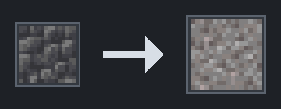
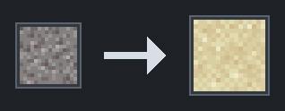
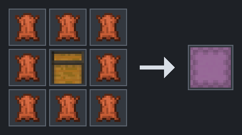
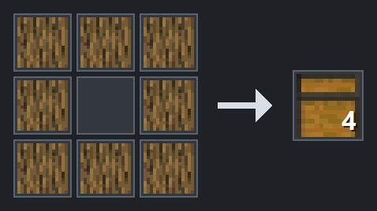
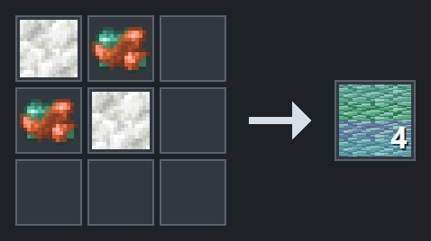
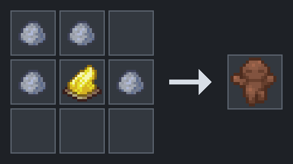
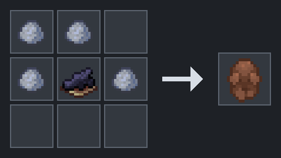
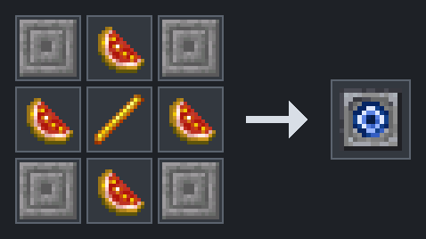

# snaxcraft crafting and material shortcuts

**Edition:** Java  
**Version:** 26.2 Paper  
**Last verified:** 2026-08-17
**Applies to:** snaxcraft server content

These non-food recipes make common building, storage, and decorative items easier to obtain. Food recipes are in the [snaxcraft kitchen cookbook](snaxcraft-kitchen.md).

## Material conversion

### Cobblestone or cobbled deepslate to gravel

Blast **1 Cobblestone or 1 Cobbled Deepslate** into **1 Gravel**.

**Time:** 5 seconds  
**Experience:** 0.1

**Ingredients:** 1 Cobblestone or 1 Cobbled Deepslate

Source: `dev/snaxcraft-content-pack/datapack/data/snax/recipe/gravel_from_blasting_cobble.json`

### Gravel to sand

Blast **1 Gravel** into **1 Sand**.

**Time:** 5 seconds  
**Experience:** 0.1

Together, the two blasting recipes make this chain:

Cobblestone or Cobbled Deepslate -> Gravel -> Sand

**Ingredients:** 1 Gravel

Source: `dev/snaxcraft-content-pack/datapack/data/snax/recipe/sand_from_blasting_gravel.json`

## Building and storage

### Leather shulker box

Craft **1 Shulker Box** from a Chest and Leather:

This is an extra shortcut. The vanilla recipe with two Shulker Shells and a Chest still works.

**Ingredients:** 8 Leather and 1 Chest

Source: `dev/snaxcraft-content-pack/datapack/data/snax/recipe/leather_shulker_box.json`
Source: https://minecraft.wiki/w/Shulker_Box

### Four chests from logs

Craft **4 Chests** from Logs:

**Ingredients:** 8 Logs (any log or stem)

Source: `dev/snaxcraft-content-pack/datapack/data/snax/recipe/chest_from_logs.json`

### Prismarine from calcite and raw copper

Craft **4 Prismarine** from Calcite and Raw Copper:

**Ingredients:** 2 Calcite and 2 Raw Copper

Source: `dev/snaxcraft-content-pack/datapack/data/snax/recipe/prismarine_from_calcite.json`

## Decorations

### Cheerful clay statue

Craft **1 Cheerful Clay Statue**.

The statue can be used like a horn and carries the description **Rejoice**.

**Ingredients:** 4 Clay Ball and 1 Yellow Dye

Source: `dev/snaxcraft-content-pack/datapack/data/snax/recipe/cheerful_clay_statue.json`

### Mournful clay statue

Craft **1 Mournful Clay Statue**.

The statue can be used like a horn and carries the description **Lament**.

**Ingredients:** 4 Clay Ball and 1 Black Dye

Source: `dev/snaxcraft-content-pack/datapack/data/snax/recipe/mournful_clay_statue.json`

### Warding Stone

Craft and place this stone for the Abbey / warding quest branch.

**Ingredients:** 4 Chiseled Stone Bricks, 4 Glistering Melon Slice, and 1 Blaze Rod

Source: `dev/snaxcraft-content-pack/datapack/data/snax_tools/recipe/warding_stone.json`

See the [Abbey / warding branch](snaxcraft-quests.md#abbey--warding-branch).

## Credit and license

NOT AN OFFICIAL MINECRAFT PRODUCT. NOT APPROVED BY OR ASSOCIATED WITH MOJANG OR MICROSOFT.

Recipes and assets adapted from Matcha Flavoured by **klei_wright**, licensed **CC-BY-NC-SA 4.0**.

Source: https://modrinth.com/datapack/matcha-flavoured

## See also

- [Kitchen recipes](snaxcraft-kitchen.md)
- [Kitchen branch in the challenge ladder](snaxcraft-quests.md#kitchen-branch)
